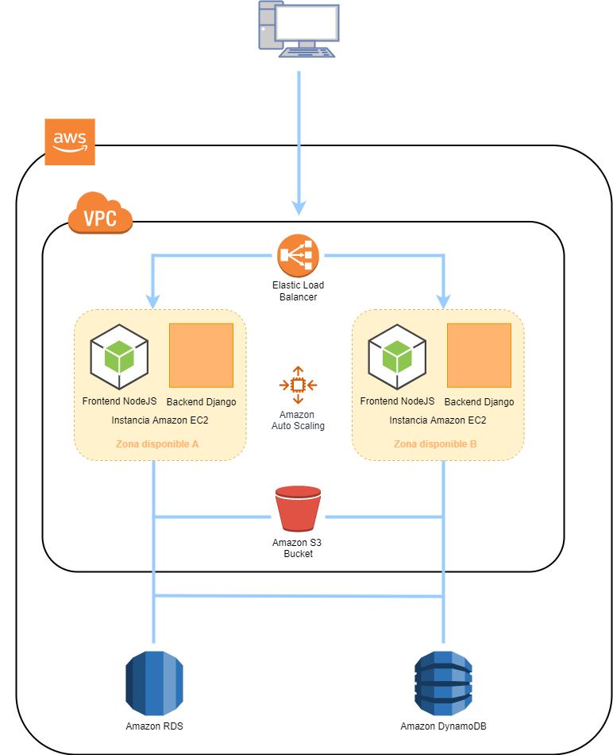

>  ***ATENCION: La prueba tecnica completa debe ser entregada en un unico repositorio***

#### Prueba 1 - Diagrama de Red

Produzca un diagrama de red (puede utilizar lucidchart) de una aplicación web en GCP o AWS y escriba una descripción de texto de 1/2 a 1 página de sus elecciones y arquitectura.

El diseño debe soportar:

- Cargas variables
- Contar con HA (alta disponibilidad)
- Frontend en Js
- Backend con una base de datos relacional y una no relacional
- La aplicación backend consume 2 microservicios externos

 
El diagrama debe hacer un mejor uso de las soluciones distribuidas.

***
## Resolución

Para la resolución de la prueba escogí una aplicación web en AWS siguiendo como base la guía de [Implementar una aplicación web de Node.js](https://aws.amazon.com/es/getting-started/hands-on/deploy-nodejs-web-app/) en la cual se habla de como implementar una aplicación de alta disponibilidad utilizando servicios de AWS. 

### Diagrama de red

### Herramientas utilizadoas

- **[Amazon EC2:](https://aws.amazon.com/es/ec2/)** Brinda servidores de aplicaciones virtuales para alojar las aplicaciones, en nuestro caso, de Node.js y Django.
- **[Elastic load balancer:](https://aws.amazon.com/es/elasticloadbalancing/)** Distribuye las solicitudes entre las distintas instancias de EC2 que estan corriendo las aplicaciones.
- **[Amazon auto scaling:](https://aws.amazon.com/es/autoscaling/)** Servicio pensado para cuando sea necesario aumentar la cantidad de servidores de aplicación disponibles, se encaga de garantizar la disponibilidad del entorno agregando y quitando servidores a medida que es requerido.
- **[Amazon S3 bucket:](https://aws.amazon.com/es/s3/)** Servicio de almacenamiento intermedio capaz de hacer de "interfaz" entre las aplicaciones de node.js y las bases de datos relacional y no relacional que son utilizadas. Su principal función es asegurar la disponibilidad de los datos, su seguridad y rendimiento.
- **[Amazon RDS:](https://aws.amazon.com/es/rds/)** Servicio para base de datos relacional de Amazon.
- **[Amazon DynameDB:](https://aws.amazon.com/es/nosql/)** Servicio para base de datos **no** relacional de Amazon.

***
## Definiciones útiles

**[Microservicios:](https://aws.amazon.com/es/microservices/)** Los microservicios son un enfoque arquitectónico y organizativo para el desarrollo de software donde el software está compuesto por pequeños servicios independientes que se comunican a través de API bien definidas. Los propietarios de estos servicios son equipos pequeños independientes.

**[VPC:](https://www.rackspace.com/es-ar/library/what-is-virtual-private-cloud)** Una nube virtual privada (VPC) es una nube privada que se ubica dentro de una nube pública que le permite aprovechar los beneficios de una red virtualizada, a la vez que utiliza los recursos de la nube pública.

***
## Links 

- [Implementar una aplicación web de Node.js](https://aws.amazon.com/es/getting-started/hands-on/deploy-nodejs-web-app/)
- [Amazon EC2](https://aws.amazon.com/es/ec2/)
- [Elastic load balancer](https://aws.amazon.com/es/elasticloadbalancing/)
- [Amazon auto scaling:](https://aws.amazon.com/es/autoscaling/)
- [Amazon S3 bucket](https://aws.amazon.com/es/s3/)
- [Amazon RDS](https://aws.amazon.com/es/rds/)
- [Amazon DynameDB:](https://aws.amazon.com/es/nosql/)
